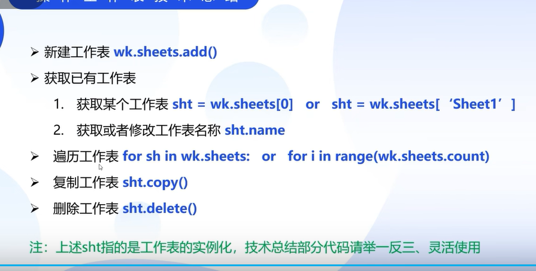
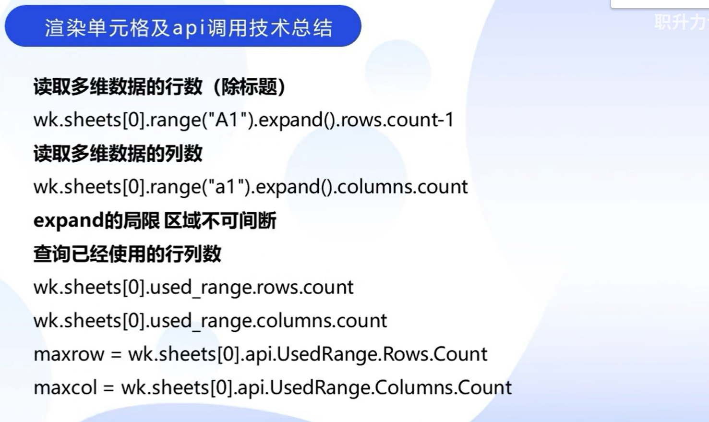
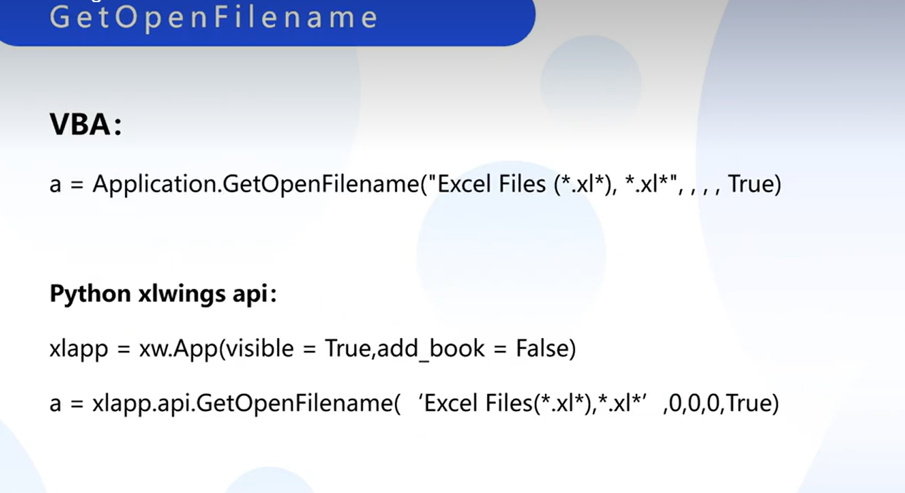
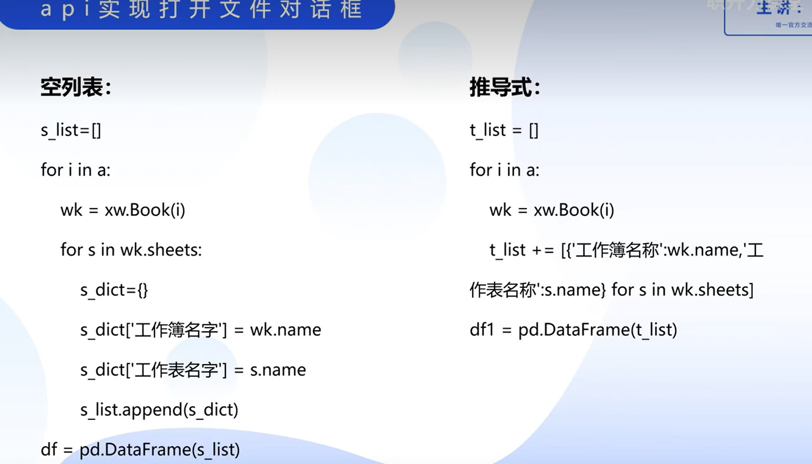
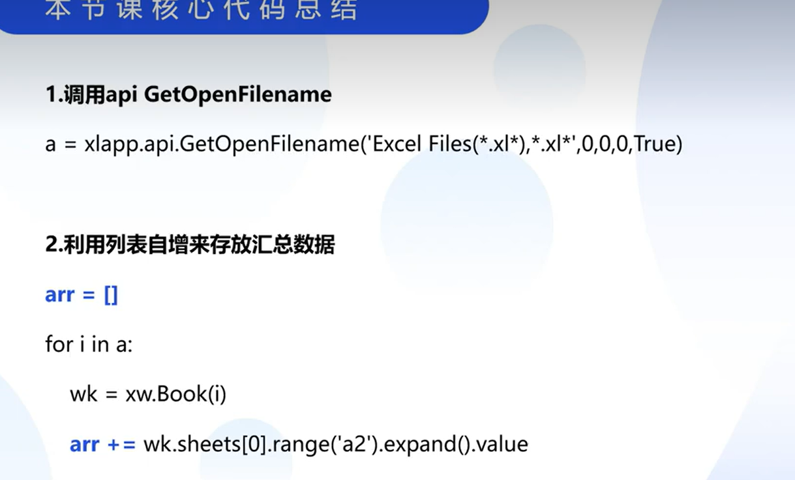

Python for Excel-xlwings 

# 工作表的操作




```VBA
Sub 宏1()
    With Selection.Font
        .Name = "宋体"
        .FontStyle = "常规"
        .Size = 11
        .Strikethrough = True
        .Superscript = False
        .Subscript = False
        .OutlineFont = False
        .Shadow = False
        .Underline = xlUnderlineStyleNone
        .ThemeColor = xlThemeColorLight1
        .TintAndShade = 0
        .ThemeFont = xlThemeFontMinor
    End With
End Sub
```

<font size=5 color='yellow'>字体中所有的格式调整都可以使用api 的方式进行调用 VBA对应的函数。VBA中xl 开头的变量均为常量，需要查询对应的常量值</font>

## <font size=6 color='pink'>api的调用</font>

 


## 拆分工作表为独立工作簿

<font size=6 color="violet">xls 格式的 65536行 256列</font>

<font size=6 color="violet">xlsx 格式的 1048576行 16384列</font>

<font size=6>字体设置 </font>


## <font color='pink'>aip 实现打开文件对话框</font>





## <font color='pink'>xlwings 实现批量工作簿h</font>

