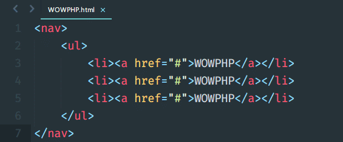
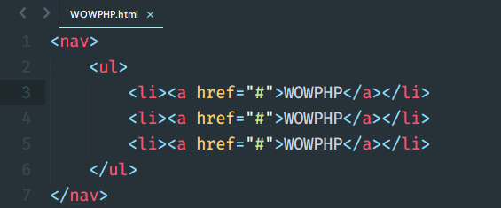
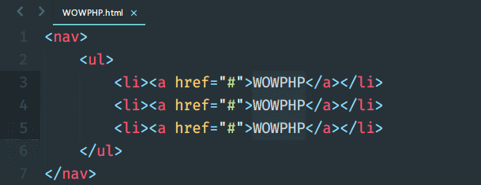
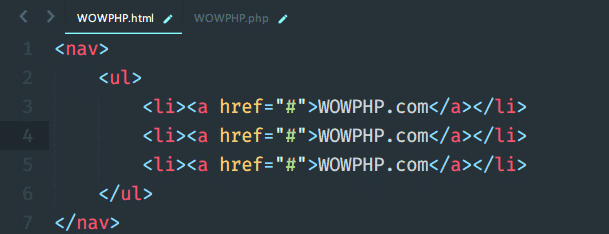
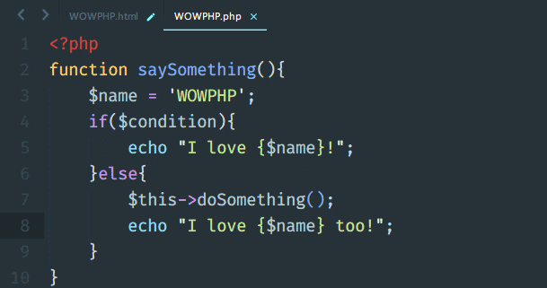
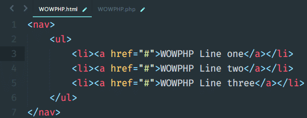
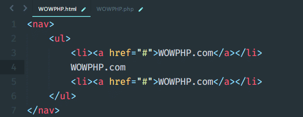
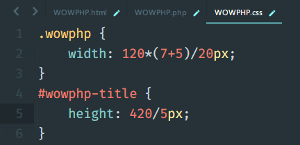

# Sublime Text怎么用？Sublime Text 9种使用技巧总结

[**Sublime Text**](https://www.php.cn/tool/sublime/) 做为 WOWPHP 中推荐的代码编辑器，呼之“神器”。既然是神器，肯定有你不知道的东西不是，下面这部分来讲Sublime Text怎么用的具体操作：（[SublimeText3汉化版下载](http://www.php.cn/xiazai/gongju/93)）

注意，Mac的 ⌘ 键对应Windows中的 ctrl 键，下文内容中以 Windows 的按键为例，如没有特殊说明，均可以互相转换使用。

## **Sublime Text 使用技巧一：就近选择相同项**

Win：CTRL + D Mac：⌘ + D

把光标放在一个单词上，按下 CTRL + D,将选择这个单词。一直按住 CTRL 且按 D多次，将选择当前选中项的下一个匹配项。通过按住 CTRL ,再按 D 三次,将选择三个相同的文本。

## Sublime Text 使用技巧二：选择当前文件所有匹配项

Win：ALT + F3 Mac：CTRL + ⌘ + G

这个操作和第一种功能一样，唯一不同的是他将会选中整个文件中的指定字符，一定要小心谨慎。

## **Sublime Text 使用技巧三：选择当前元素的父级标签**

Win：CTRL + SHIFT + ' Mac：⌘ + ⇧ + K

当你需要替换一个元素的父级标签时（前端开发人员会用得到），需要选中这个元素的首尾标签进行修改，这样很麻烦。在sublime中，你可以很快的进行这个操作。

比如我想把a链接替换为button，如下图，只需要按照前面说的方法选批量中子元素，然后按快捷键就可以选中a标签，之后就可以替换为button标签了。

需要Emmet插件

## **Sublime Text 使用技巧四：选择当前元素的父级标签由子元素向上选择父元素**

Win：CTRL + SHIFT + A Mac：CTRL + D

这个快捷键将会将选择父容器,再按一次,将选择父容器的父容器...以此类推。

需要Emmet插件

## **Sublime Text 使用技巧五：选择括号内的内容**

Win：CTRL + SHIFT + M Mac：⌘ + ⇧ + SPACE

这有助于选择括号之间的所有内容。同样适用于CSS。

## **Sublime Text 使用技巧六：上移或下移行**

Win：CTRL + SHIFT + ↑ 或 ↓ Mac：⌘ + CTRL + ⇧ 或 ⇩

## **Sublime Text 使用技巧七：用标签包裹行或选中项**

Win：ALT + SHIFT + W Mac：CTRL + ⇧ + W

## **Sublime Text 使用技巧八：计算数学表达式**

Win：CTRL + SHIFT + Y Mac：⌘ + ⇧ + Y

这个功能很有意思，实际上很多情况下都可以用得到，只要有表达式，就可以快速的帮你算出结果。

## **Sublime Text 使用技巧九：大小写转换**

Win：CTRL + K 再按 U(大写) CTRL + K 再按 L(小写) Mac：⌘ + K 再按 U(大写)⌘ + K 再按 L(小写)