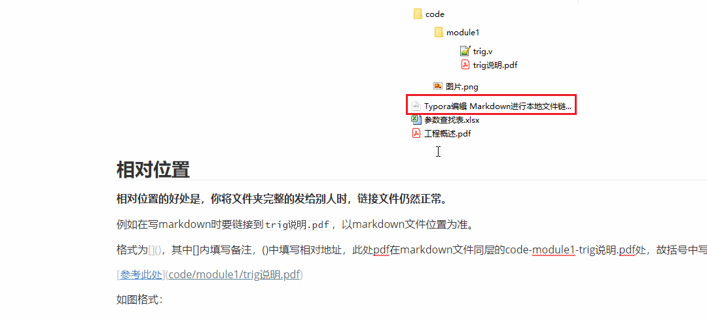
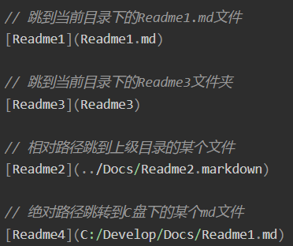
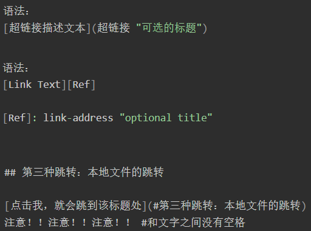
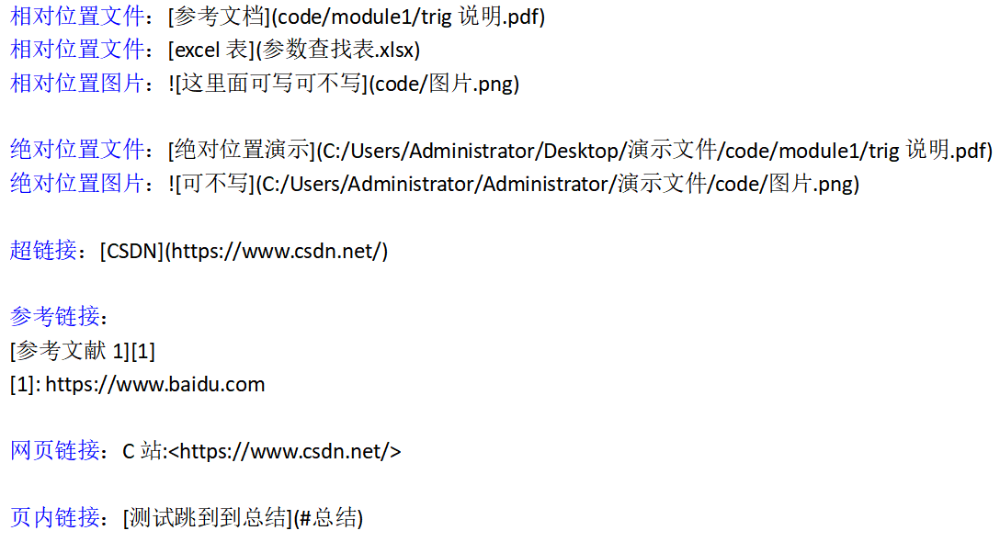
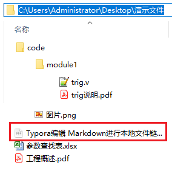
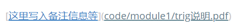
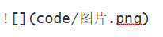
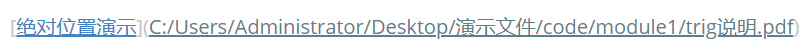

<a id="目录"></a>

[toc]


## 一、Markdown与Typora介绍

### 1.1 Markdown介绍

```
Markdown 是一种轻量级标记语言，它允许人们使用易读易写的纯文本格式编写文档。
Markdown 语言在 2004 由约翰·格鲁伯（英语：John Gruber）创建。
Markdown 编写的文档可以导出 HTML 、Word、图像、PDF、Epub 等多种格式的文档。
Markdown 编写的文档后缀为 .md, .markdown。
```

### 1.2 Typora介绍与下载

Typora编辑器让人们能更简单地用Markdown语言书写文字，解决了使用传统的Markdown编辑器写文的痛点，并且界面简洁优美，实现了实时预览等功能。

Typora官网： https://typora.io/

windos版本下载地址：https://typora.io/#windows

请根据自己的电脑配置自行下载安装，过程简单，在此不多做介绍。

## 二、Markdown语法

### 2.1 标题

使用 # 可以表示标题，一级标题对应一个 # ，二级标题对应两个 # 号，最多至六级标题。在Typora中，# 后要紧接着一个空格才能表示标题，否则就是普通字符。

在Typora中，也可以使用快捷键Ctrl+1（2，3，4，5，6）表示相对应的标题。Ctrl+0表示段落。标题快捷键信息可在菜单栏中的段落选项下查看。

### 2.2 字体

* 用一对星号 * 括住的文本表示斜体文本，如：* 要变斜体的文本 * ，*斜体文本* ；
* 也可以用一对下划线 _ 括住文本来表示斜体文本，如：_ 要变斜体的文本 _ ，_斜体文本_ ；
* 也可以使用Typora的快捷键 **Ctrl+I** 来表示斜体文本。


### 2.3 各种线

分割线，可以使用三个及以上的 + 号或 * 号或 - 来表示一条分割线；
由三个*号表示的分割线：

****

由三个+号表示的分割线：

+++

由三个-号表示的分割线：

---


### 2.4 列表

#### 无序列表

可以使用 *，+或-标记符号来表示无序列表项，记住要在标记符号后添加一个空格，语法显示如下：

* ```
  * 第一项
  * 第二项
  
  + 第一项
  + 第二项
  
  - 第一项
  - 第二项
  ```

  结果如下：

* 第一项
* 第二项
* 第一项
* 第二项
* 第一项
* 第二项

#### 有序列表

可以使用数字加上.再加上空格来表示有序列表，语法如下：

1. ```
   1. 第一项
   2. 第二项
   3. 第三项
   ```

   结果如下：

1. 第一项
2. 第二项
3. 第三项
   从结果可以看出，数字并不重要。

#### 嵌套列表

- 一
  - 1.1
    - 1.1.1
      - 1.1.1.2
        - 1.1.1.3
- 二
  - 2.1
    - 2.1.1
      1. 有序列表第一项
      2. 有序列表第二项

首先使用*、+或-进入列表，然后回车换行，会发现系统自动生成列表第二项，此时按下Tab键，列表第二项变为第一项的子列表。按回车退出当前列表。可以在无序列表中嵌套有序列表。

1. 一
   1. 一、一
      1. 一、一、一
         1. 一、一、一、一
         2. 一、一、一、二
2. 二
   1. 二、一
   2. - 无序列表第一项
      - 无序列表第二项

也可以在有序列表中嵌套无序列表。

### 2.5 区块

当我们想要引用别人的文章内容时，可以将其放在区块内。

可以使用>加空格来表示区块。

> 这是区块
>
> 区块也可以嵌套
>
> > 二级区块
> >
> > > 三级区块


要退出区块，同样使用Enter键即可。

### 2.6 代码

如果是一行代码，可以使用段内代码块来表示，用一对 `（数字1旁边的符号）括住代码。

比如`printf("Hello World!")`

如果是代码段，那么可以使用三个 ` 加Enter/空格+编程语言来表示。如：

```
include <stdio.h>
void main(){
	printf("Hello world!\n");
}
```


可以在代码块的右下角选择编程语言。

### 2.7 链接

链接的使用方式有两种语法，如下：

```
[链接文字](链接地址)
或
<链接地址>
```


我们可以使用链接打开网页，示例如下：

```
[百度](https://www.baidu.com/)
<https://www.baidu.com/>
```

显示效果如下：

[百度](https://www.baidu.com/)
<https://www.baidu.com/>

当鼠标移到相应的链接文字时，按住Ctrl+鼠标左键点击访问。

链接除了可以打开相应的网页外，还可以打开本地文件，使用方式类似，不过链接地址需要使用本地文件的地址，相对地址、绝对地址均可：

示例：

```
[打开LinkTest.md文档](./LinkTest.md)
[打开LinkTest.png照片](./img/LinkTest.png)
```


结果如下：

[打开LinkTest.md文档](./LinkTest.md)
[打开LinkTest.png照片](./img/LinkTest.png)

经测试可以打开相应的文件。但是不能使用<要打开的文件地址>来打开相应的文件，比如<./LinkTest.md>并没有表现为可链接状态。

补充知识：

一个小圆点.表示当前目录，故./LinkTest.md表示当前目录下的LinkTest.md文件，./img/LinkTest.png表示当前目录下的img文件下的LinkTest.png文件。

两个小圆点..表示上一级目录。

我们也可以使用链接来实现页内跳转，语法为：

```
[链接文字](#标题文字)
```

示例：

```
[跳转到第一章第一节](#1.1 Markdown介绍)
```

结果如下：
[跳转到第一章第一节](#1.1 Markdown介绍)

经测试，可以成功跳转。
在CSDN中不支持这种页内跳转方式。

### 2.8 图片

我们也可以在Markdown文档中插入图片，语法如下：

```


```

* 首先一个感叹号
* 然后中括号里面写属性文本
* 小括号里面写图片地址，后可接标题

示例语法：

```
   #本地照片

   #本地照片


在Typora中，也可以直接使用Ctrl+C，Ctrl+V来直接进行复制粘贴图片，但是，由于Markdown是需要图片的地址的，所以需要简单设置一下Typora。

点击文件 --> 偏好设置 --> 图像，如下：

![[外链图片转存失败,源站可能有防盗链机制,建议将图片保存下来直接上传(img-cJcfQ4sd-1572414627616)(img/image-20191029190539469.png)]](https://img-blog.csdnimg.cn/20191108173127600.png?x-oss-process=image/watermark,type_ZmFuZ3poZW5naGVpdGk,shadow_10,text_aHR0cHM6Ly9ibG9nLmNzZG4ubmV0L3FxXzQxMjYxMjUx,size_16,color_FFFFFF,t_70)

可以自行设置选择将图片复制到哪个文件夹。

![[外链图片转存失败,源站可能有防盗链机制,建议将图片保存下来直接上传(img-tPqjvvPS-1572414627619)(img/image-20191029190813277.png)]](https://img-blog.csdnimg.cn/20191108173139695.png)

这里选择复制到指定路径，然后在下面一栏中填写./img，表示将图片复制到你正在编辑的文档同一级的img文件夹下。在下面的选项中，勾选第一、二、三项。正因为勾选了第二项，所以当我们在插入网络图片时，Typora会自动帮我们将网络图片下载到指定的路径下，前面的"菜鸟教程"图片便是如此。

由于Markdown的特殊语法，故经常会出现图片加载失败的情况，很大的可能就是因为在指定的路径上找不到相应的图片，当然，有时候也是由于Typora的原因，重启Typora即可。

### 2.9 表格

Markdown 制作表格使用 | 来分隔不同的单元格，使用 - 来分隔表头和其他行。

语法如下：

```
|表头|表头|表头|
|---|---|----|
|单元格|单元格|单元格|
|单元格|单元格|单元格|
```

结果如下：

| 表头                   | 表头   | 表头   |
| ---------------------- | ------ | ------ |
| 单元格                 | 单元格 | 单元格 |
| 单元格                 | 单元格 | 单元格 |
| 我们可以设置对齐方式： |        |        |

- :-表示左对齐

- -:表示右对齐

- :-:表示中间对齐

  

示例如下：

```
|左对齐|右对齐|中间对齐|
|:---|---:|:----:|
|单元格|单元格|单元格|
|单元格|单元格|单元格|
```

| 左对齐 | 右对齐 | 中间对齐 |
| :----- | -----: | :------: |
| 单元格 | 单元格 |  单元格  |
| 单元格 | 单元格 |  单元格  |

在Typora中，我们可以使用快捷键Ctrl+T来插入表格，并选择行列，当选中表格某一单元格时，可以在表格左上角手动设置对齐方式，右上角选择更多操作。

## 三、Typora与数学公式

在本章中，重点不在于介绍如何插入数学公式，而在于如何表示数学符号。

### 3.1 如何插入数学公式

在Typora中，有两种方法插入数学公式，语法为：

```
第一种方法：$数学公式$
第二种方法：
$$
数学公式
$$
```


第一种方法表示插入行内公式（内联公式），即可以将公式插入到一行中，比如1 + 2 = 3 1+2=31+2=3这样的公式。

第二种方法表示插入行间公式（外联公式），即可以将公式插入到行与行之间，单独占据一行或者数行的空间，并且居中放置。
$$
1 + 2 = 3
$$
如果要在行间公式内换行，在换行的位置使用 \ \ 。

接下来重点介绍如何表示数学符号。

### 3.2 上标下标

上下标可以使用^，_后跟相应的符号来实现。如：

上 标 ：  a1  下 标 ： a 1 上标：a^1，下标：a_1上标：a 1
 ，下标：a_1

如果作为上标、下标的符号不止一个，则需要用花括号{}将其括起来。如：

[返回目录](#目录)

### 3.3 根号

我们可以使用\sqrt{}来表示根号。如：

\sqrt{2} , \sqrt{5}
1
结果为：

2 , 5 \sqrt{2},\sqrt{5} 

我们也可以使用\sqrt[]{}来表示更具体的根号信息：

\sqrt[3]{4}，\sqrt[4]{10}
1
4 3 ， 10 4 \sqrt[3]{4}，\sqrt[4]{10} 

### 3.4 上下水平线

我们可以使用\underline{},\overline{}来表示上下水平线，如：

$下水平线：\underline{a+b}$
$上水平线：\overline{a+b}$
1
2
结果为：

下 水 平 线 ： a + b ‾ 下水平线：\underline{a+b}下水平线： 
a+b

 

上 水 平 线 ： a + b ‾ 上水平线：\overline{a+b}上水平线： 
a+b

 

### 3.5 上下水平大括号

我们可以使用\overbrace{} 和 \underbrace{} 在表达式的上、下方给出一水平的大括号

$\overbrace{x_1+x_2+x_3}$
$\underbrace{x_1+x_2+x_3}$
1
2
结果为：

x 1 + x 2 + x 3 ⏞ \overbrace{x_1+x_2+x_3} 
x 
1

 +x 
2

 +x 
3

 

x 1 + x 2 + x 3 ⏟ \underbrace{x_1+x_2+x_3} 
x 
1

 +x 
2

 +x 
3

 

 

当然，我们也可以在括号上添加说明，使用语法为\overbrace{}^{}和\underbrace{}_{}

$\overbrace{x_1+x_2+x_3}^{3个元素}$
$\underbrace{x_1+x_2+x_3}_{3个元素}$
1
2
x 1 + x 2 + x 3 ⏞ 3 个 元 素 \overbrace{x_1+x_2+x_3}^{3个元素} 
x 
1

 +x 
2

 +x 
3

 


3个元素

 

x 1 + x 2 + x 3 ⏟ 3 个 元 素 \underbrace{x_1+x_2+x_3}_{3个元素} 
3个元素
x 
1

 +x 
2

 +x 
3

 

 

 

### 3.6 向量符号

我们可以使用\vec{}来表示单个字母向量，其实也可以表示多个字母，但不美观，另两个命令\overrightarrow{} 和\overleftarrow{}在定义从A 到B 的向量时非常有用。如：

$\vec{a}$
$\vec{AB}$
$\vec{ABC}$
$\overrightarrow{AB}$
$\overleftarrow{AB}$
1
2
3
4
5
结果为：

a ⃗ \vec{a} 
a

A B ⃗ \vec{AB} 
AB


A B C ⃗ \vec{ABC} 
ABC


A B → \overrightarrow{AB} 
AB

A B ← \overleftarrow{AB} 
AB

### 3.7 分数

我们可以使用\frac{}{}来表示分数，如：

$\frac{1}{2}$
$\frac{\sqrt{3}}{4}$
1
2
结果为：

1 2 \frac{1}{2} 
2
1


3 4 \frac{\sqrt{3}}{4} 
4
3

 

 

### 3.8 积分运算符

积分运算符用\int 来生成 ，用\int_{}^{}来表示积分上下界，如：
$$
$\int$
$\int_{1}^{2}$
$$
1
2
结果为：
$$
∫ \int∫
 \int_{1}^{2}∫
$$
1
2

 

### 3.9 求和运算符

求和运算符可以使用\sum来生成，用\sum_{}^{}来表示求和上下界，如：

$\sum$
$\sum_{i=1}^{10}x_i$
1
2
结果为：

∑ \sum∑
∑ i = 1 10 x i \sum_{i=1}^{10}x_i∑ 
i=1
10

 x 
i

 

求和符号的上下标在内联公式里，表现为上面那样，当在外联公式里时，表现如下：
∑ i = 1 10 x i \sum_{i=1}^{10}x_i
i=1
∑
10

 x 
i

 

### 3.10 连乘运算符

连乘运算符用\prod{}表示，同样地，上下标用prod_{}^{}表示，如：

$\prod$
$\prod_{i=1}^{10}x_i$
$$
\prod_{i=1}^{10}x_i
$$
1
2
3
4
5
结果为：

∏ \prod∏
∏ i = 1 10 x i \prod_{i=1}^{10}x_i∏ 
i=1
10

 x 
i


∏ i = 1 10 x i \prod_{i=1}^{10}x_i
i=1
∏
10

 x 
i

 

### 3.11 特殊符号

希腊字母

α \alphaα为\alpha，β \betaβ为\beta，γ \gammaγ为\gamma，θ \thetaθ为\theta，ρ \rhoρ为\rho，λ \lambdaλ为\lambda，μ \muμ为\mu

Δ \DeltaΔ为\Delta，π \piπ为\pi，Ω \OmegaΩ为\Omega

关系运算符

大于>，大于等于≥ \geq≥为\geq或\ge

小于<，小于等于≤ \leq≤为\leq或\le

等于=，不等于≠ \neq 


 =为\neq或\ne

加减乘除

加+ 减-

乘× \times×为\times 除÷ \div÷为\div

### 3.12 矩阵表示

我们可以使用以下格式来显示矩阵：
$$
\begin{matrix}
1 & 2 & 3\\
4 & 5 & 6\\
\end{matrix}
$$
1
2
3
4
5
6
结果为：
1 2 3 4 5 6
142536
1
2
3
4
5
6
1
4


2
5


3
6

 

可是这并不是我们常见的矩阵啊，旁边的中括号呢？

别急，我们先把上面的公式说明一下：

\begin{matrix}和\end{matrix}说明在它们之间的是矩阵

1 & 2 & 3\\表示第一行的元素，其中用&来分割每一个元素，用\\来换行

现在我们来加括号，很简单，语法如下：

$$
\left[\begin{matrix}
1 & 2 & 3\\
4 & 5 & 6
\end{matrix}\right]
$$
1
2
3
4
5
6
结果为：
[ 1 2 3 4 5 6 ] \left[
142536
1
2
3
4
5
6
\right]
[ 
1
4


2
5


3
6

 ]

其实我们仅仅在\begin{matrix}前面加了\left[，在\end{matrix}后面加了\right]，这样就能正确显示括号了，那我们可以将[]改为||吗，当然可以，就简单地把\left[，\right]改为\left|和\right|即可。

$$
\left|\begin{matrix}
1 & 2 & 3\\
4 & 5 & 6
\end{matrix}\right|
$$
1
2
3
4
5
6
结果就能显示为行列式了。
∣ 1 2 3 4 5 6 ∣ \left|
142536
1
2
3
4
5
6
\right|
∣
∣
∣
∣


1
4


2
5


3
6


∣
∣
∣
∣

 

这里仅仅介绍简单的矩阵表示，如果要了解更多矩阵表示法，请自行搜索了解，网上的资料很多。

### 3.13 方程组

$$
\begin{equation}
\left\{
             \begin{array}{lr}
             x=\dfrac{3\pi}{2}(1+2t)\cos(\dfrac{3\pi}{2}(1+2t)), &  \\
             y=s, & 0\leq s\leq L,|t|\leq1.\\
             z=\dfrac{3\pi}{2}(1+2t)\sin(\dfrac{3\pi}{2}(1+2t)), &  
             \end{array}
\right.
\end{equation}
$$
1
2
3
4
5
6
7
8
9
10
11
结果如下：(CSDN不支持）
KaTeX parse error: No such environment: equation at position 8: \begin{̲e̲q̲u̲a̲t̲i̲o̲n̲}̲ \left\{ …

现在我们一一来解释：

begin{equation}与\end{euqation}表示它们之间的为方程组。

\left\{和\right.表示在方程组的左边加上{，在右边加上.，因为{在外联公式中有特殊的意义，因此需要在其前面加上转义字符\。

\begin{array}和\end{array}表示它们之间的是数组，其实这也可以用来表示矩阵。

{lr}表示有两列，第一列的值靠左排列，用l表示，第二列的值靠右排列，用r表示，如果是中间对齐则为c。

然后下面三行是方程式，用&分割，用\\换行。

### 3.14 分段函数

其实分段函数与方程组类似，示例如下：
$$
y=
\begin{equation}
	\left\{
		\begin{array}{lr}
		x-1 & x \leq 0
		x+1 & x>0
		\end{array}
	\right. 
\end{equation}
$$
1
2
3
4
5
6
7
8
9
10
11
结果如下：（CSDN不支持）
KaTeX parse error: No such environment: equation at position 11: y= \begin{̲e̲q̲u̲a̲t̲i̲o̲n̲}̲ \left\{ \be…
就是在\begin{equation}前加y=即可。

## 四、Typora与HTML

### 4.1 改变字体颜色及大小

我们可以使用<font> </font>标签来改变字体的颜色及大小，如：

<font size=3 color="red">字体颜色为红色，大小为3</font>

<font size=4 color="blue">字体颜色为蓝色，大小为4</font>

<font size=6 color="violet">字体颜色为紫罗兰，大小为6</font>
1
2
3
4
5
结果为：

字体颜色为红色，大小为3

字体颜色为蓝色，大小为4

字体颜色为紫罗兰，大小为6

属性size表示字体大小，color表示颜色。

### 4.2 改变对齐方式

我们可以改变字体的对齐方式，用标签<p> </p>加上属性align，如：

<p align="left">左对齐</p>
<p align="center">中间对齐</p>
<p align="right">右对齐</p>
1
2
3
结果为：

左对齐

中间对齐

右对齐

### 4.3 插入图像

因为CSDN不支持使用img标签修改图像，所以下面的结果都不是准确的。大家可以自己在Typora中测试。
我们可以通过标签来插入图片，如：


1
结果为：


我们可以改变标签的属性，来改变图片的大小。


1
将图片的宽高均设为100，结果为：


也可以改变图片的位置，如：

图片在左边
图片在右边
1
2
结果为：

图片在左边
图片在右边

## 五、扩展用法

### 5.1 插入emoji表情

我们可以使用:emoji:的语法来插入表情，比如：

happy:的语法为:happy:

🦀的语法为：crab:

🐴的语法为：horse:

### 5.2 插入目录

当我们为使用标题将文分章节后，可以在输入[toc]命令的地方自动根据标题生成目录。

### 5.3 导出

选择文件 --> 导出，可以选择导出的文件格式，有pdf,html,word等格式。

### 5.4 文本高亮

在Typora中，可以用一对==将要高亮的文本括起来，如：

```
==要高亮的文本==
==背景会用黄色填充==
```

1
2
结果为：

==要高亮的文本==
==背景会用黄色填充==

这个功能可在偏好设置 --> Markdown扩展语法中设置。

### 5.5 上下标

在Typora中，可以用一对~将下标括起来，如：H~2~O表示H2O

同样，我们也可以用一对^将上标括起来，如：X^2^表示X2

上下标可在偏好设置 --> Markdown扩展语法中设置。

六、参考资料
[1] 菜鸟Markdown教程：https://www.runoob.com/markdown/md-tutorial.html

[2] 更多数学符号表达式：http://mohu.org/info/symbols/symbols.htm

[3] Latex 方程组表示： https://blog.csdn.net/lemolemac/article/details/9057471

[4] 菜鸟HTML教程：https://www.runoob.com/html/html-tutorial.html
------------------------------------------------
版权声明：本文为CSDN博主「水木子_」的原创文章，遵循CC 4.0 BY-SA版权协议，转载请附上原文出处链接及本声明。
原文链接：https://blog.csdn.net/qq_41261251/article/details/102817673


# typora常用技巧


## 生成菜单栏

```
输入 [toc] + 回车键
产生标题，自动更新
```


## 区域元素

## 标题

```
标题 1~6
开头#的个数表示，空格+文字。标题有1~6个级别，#表示开始，按换行键结束

    # H1

    ## H2

    ###### H6

​    对应的快捷键： ctrl + 1/2/3/4/5/6
```


## 引注

## 无序序列

```
*/+/-， 空格 + 文字，创建无序序列
换行键换行
双回车或删除键跳出
```

## 有序序列

```
空格 + 文字，创建有序序列
换行键换行,序列自动递增
 双回车或删除键跳出
```

## 可选序列

```
序列+空格+[+空格+]+空格+文字，换行键换行，删除键跳出
-[ ]a				[ ] 中为空格，则没有选中
+ [ ] b
- [x] completed		[ ]中为x，则默认选中
```

## 代码块

```
	```+语言名 + 回车，开启代码块
	换行键换行，光标下移键跳出
```

## 表格

```
  |+列名+|+列名+|+换行键，创建一个2*2表格
  将鼠标放置其上，弹出编辑尺寸，个数，文字等
  建议使用快捷键：ctrl + T
```

## 脚注

```
在需要添加脚注的文字后面+[+^+序列+]，注释的产生可以鼠标放置其上单击自动产生
添加信息或人工添加+[+^+序列+]+:
```


## 水平线

```
输入***/---，换行键换行
```

## 数学块

```
 数学块
使用MtathJax建立数学公式
开头$$+换行键，产生输入区域，输入Tex/LaTex格式的数学公式
例：
	\mathbf{V}_1 \times \mathbf{V}_2 = \begin{vmatrix}
	\mathbf{i} & \mathbf{j} & \mathbf{k} \
	\frac{\partial X}{\partial u} & \frac{\partial Y}{\partial u} & 0 \
	\frac{\partial X}{\partial v} & \frac{\partial Y}{\partial v} & 0 \
	\end{vmatrix}
```

效果
$$
\mathbf{V}_1 \times \mathbf{V}_2 = \begin{vmatrix}
	\mathbf{i} & \mathbf{j} & \mathbf{k} \
	\frac{\partial X}{\partial u} & \frac{\partial Y}{\partial u} & 0 \
	\frac{\partial X}{\partial v} & \frac{\partial Y}{\partial v} & 0 \
	\end{vmatrix}
$$


## 特征元素

## 链接

```
	单击链接，展开后可编辑
	ctr+单击，打开链接
```


## 超链接

	内行式：小括号内容不显
			[百度](https://www.baidu.com/) 
	参考式：网址可以显示出来
		[百度][]https://www.baidu.com/
	快速链接
		<http://www.baidu.com>
## 内链接

```
	<a href="#标题名">点击跳转</a>
	标题名必须在本文件中存在，几级标题均可
```


## 字体

```
	斜体	ctrl + i
		*斜体*
	粗体	ctrl + b
		**斜体**
	斜体+粗体	
		***斜体+粗体***	
	删除线	
		~~删除线~~
	下划线 	ctrl + u
		<u>下划线</u>
	代码 
		`代码`
	下标
		H~2~o
	上标
		H^2^o
	高亮
		==高亮==
```


## 快捷键汇总

​	

```
	ctrl + F 	查找
	Ctrl+L  选中某句话   
	Ctrl+K  创建超链接
	Ctrl+D  选中某个单词
	Ctrl+E  选中相同格式的文字   
	Ctrl+H  搜索并替换
	Alt+Shift+5 删除线 
	Ctrl+Shift+I    插入图片
	Ctrl+Shift+M    公式块 
	Ctrl+Shift+Q    引用
	Ctrl+B  字体加粗
	Ctrl+I  字体倾斜
	Ctrl+U  下划线
	Ctrl+Home   返回Typora顶部
	Ctrl+End    返回Typora底部
	Ctrl+T  创建表格
```

*<big><font  color='blue'>[返回目录](#目录)</font></big>*

# Typora编辑 Markdown进行本地文件链接、页内链接、网页链接格式

[参考网址：](#https://blog.csdn.net/weixin_48412658/article/details/131694891?ops_request_misc=%257B%2522request%255Fid%2522%253A%2522169811831816800185876201%2522%252C%2522scm%2522%253A%252220140713.130102334..%2522%257D&request_id=169811831816800185876201&biz_id=0&utm_medium=distribute.pc_chrome_plugin_search_result.none-task-blog-2~all~sobaiduend~default-1-131694891-null-null.nonecase&utm_term=Typora%20%E9%93%BE%E6%8E%A5&spm=1018.2226.3001.4187)

本文讲解Typora编辑 Markdown进行本地文件链接、网页链接、页内链接、的格式，这对于做笔记时链接本地的参考资料，网络资料，页内跳转时非常方便，`CTRL+鼠标左键`点击即可打开。如下图所示，点击链接即可打开对应文件：



## 总结

此处为格式，细节讲解参照后面。

## 本地文件链接：



## 网页和页内链接：



结合下面内容的例子使用：



## 本地文件链接

为清晰演示，我在桌面建了个文件夹演示文件文件夹，你也可以做一个同样的层级作为练习。

演示文件文件夹中包含code文件夹、此markdown文档、参数查找表.xlsx、工程概述pdf。

code中又包含module1文件夹和图片.png。

module1文件夹中又包含trig.v和trig说明.pdf

层级结构如下：



## 相对位置

相对位置的好处是，你将文件夹完整的发给别人时，链接文件仍然正常。

例如在写markdown时要链接到trig说明.pdf，以markdown文件位置为准。

格式为，其中[]内填写备注，()中填写相对地址，此处pdf在markdown文件同层的code-module1-trig说明.pdf处，故括号中写入code/module1/trig说明.pdf

如图格式：



插入本地图片可用英文！+中括号[]+(写入相对地址)进行插入。格式如下：



## 绝对位置

**绝对位置如果你将文件夹位置改变，链接文件便需要修改为新地址。**




## 网页链接

### 超链接跳转

格式为 [ ]再加上( )，中括号中放信息，小括号中放网址。

例如CSDN作为链接：


### 参考链接

好处是当我们在多处地方使用这个 跳转链接时，都没必要复制一遍地址。


### 网页链接

格式为 <写入网页>


## 页内链接

格式为 [参考说明]加上(#标题名) **#和文字之间没有空格**

此处由于本篇有标题为`总结`如：


此法在typora中实用，CSDN中不实用。

## 参考

参考文章1：https://blog.csdn.net/qq_41907769/article/details/121722716

*<big><font  color='blue'>[返回目录](#目录)</font></big>*

+++


